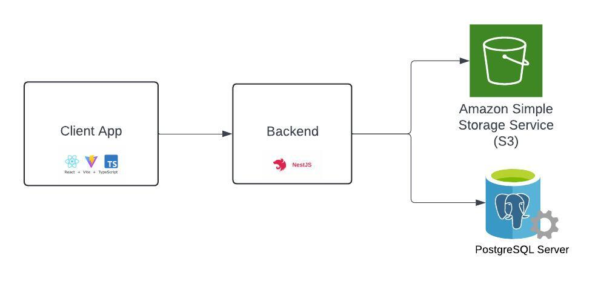

# NodeJS API for ecommerce website

## A NodeJS application which is based on <a href="https://nestjs.com/">NestJS</a> framework to provide API endpoints for small ecommerce system
This project is the backend of a small ecommerce system. Some main features that I have developed are:
* Sign up, sign in, update user information such as personal information profile picture
* Create, update, get list categories
* Create, update, get list of products with information including: name, images, sizes, colors, description, price
* Order management
* Customer purchase flow including view product details, add product to cart and checkout

## Architecture
The diagram below show overview architecture of the entire system



Reference:
* Client app repo: https://github.com/manhnd9293/my-commerce-fe

## How to install this project on local machine

Follow below steps to install this project on local machine:

1. Install NodeJS version 18.0 or later
2. Clone this project
3. Run command ```yarn install``` to install all project's dependencies

## How to Run the app
Before starting the application, you need to set up and running following components:
1. Postgres database and credential data to access it
2. AWS S3 bucket and an IAM user with read and write permission to that bucket and its access key 

Follow below steps to run the app locally
1. Provide file .env with information as in file .env.example in root folder of this repository
2. Run one of following commands:

```bash
# development
$ yarn run start

# watch mode
$ yarn run start:dev

# production mode
$ yarn run start:prod
```
## Stay in touch
* Author - [Manh Nguyen](https://github.com/manhnd9293)

